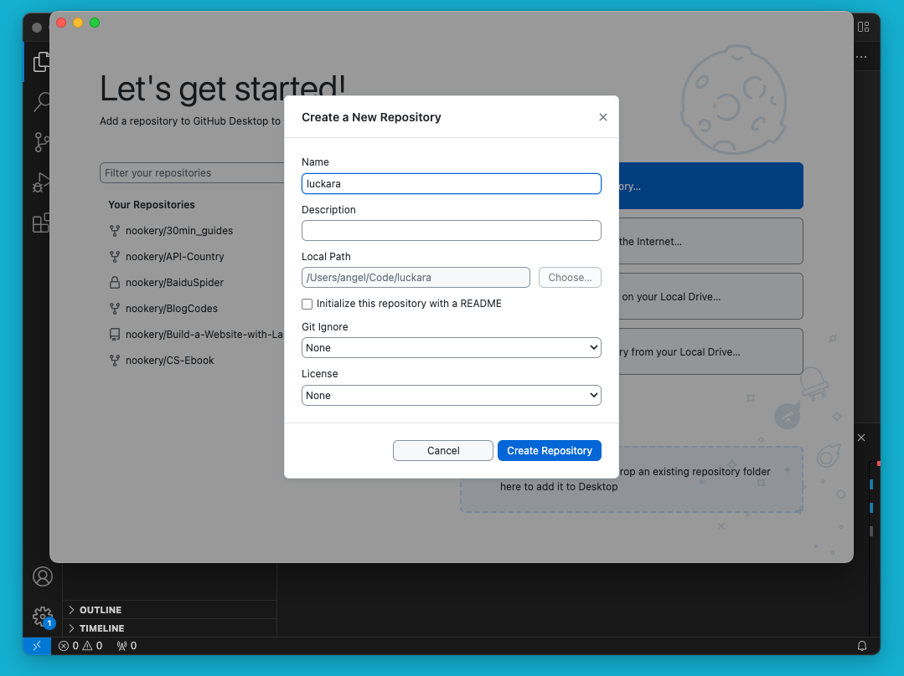
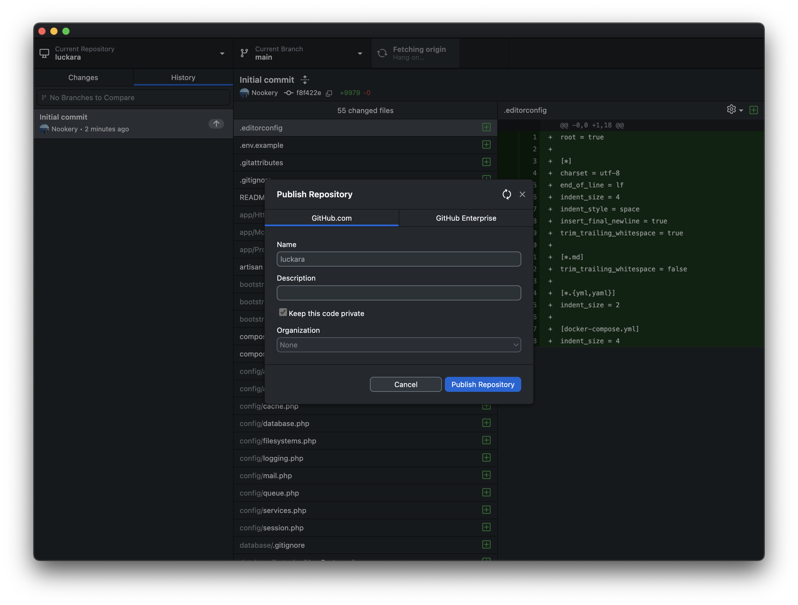

## What is Laravel

Laravel is a PHP framework. It provides many useful tools to help you build web applications quickly and easily.

The word "Laravel" does not exist in English. How did this name come about? It is said that the creator of Laravel, Taylor Otwell, was inspired by Cair Paravel, the castle in the novel "The Chronicles of Narnia," and decided to name his framework Laravel.

**If you encounter any issues, remember to check the official documentation for answers first.**

https://laravel.com/docs/11.x

## Installation

Before creating your first Laravel project, make sure that your local machine has PHP and Composer installed.

### PHP

Check if PHP is already installed

```bash
php -v
```

If PHP is not installed, please follow the previous article to install PHP.

### Composer

Composer is a package manager for PHP. It helps you install and update the dependencies of your project.

Check if Composer is already installed

It's a bit different here, Composer's -V is an uppercase V.

```bash
composer -V
```

And you will see：

```bash
Composer version 2.7.2 2024-03-11 17:12:18 PHP version 8.3.3 (/opt/homebrew/Cellar/php/8.3.3_1/bin/php)
```

If Composere is not installed, you will see:

```bash
command not found: composer
```

If that's the case, let's install it.

Open the page: https://getcomposer.org/download/

Run these commands:

```bash
php -r "copy('https://getcomposer.org/installer', 'composer-setup.php');" php -r "if (hash_file('sha384', 'composer-setup.php') === 'dac665fdc30fdd8ec78b38b9800061b4150413ff2e3b6f88543c636f7cd84f6db9189d43a81e5503cda447da73c7e5b6') { echo 'Installer verified'; } else { echo 'Installer corrupt'; unlink('composer-setup.php'); } echo PHP_EOL;" php composer-setup.php php -r "unlink('composer-setup.php');"
```

And

```bash
sudo mv composer.phar /usr/local/bin/composer
```

That’s all!

### Node.js

A very useful software that many projects require, just install it!

You can use the following command to install Node.js:

brew install nodeAfter installation is complete, enter this code in the terminal app and hit enter to run.

```bash
node -v
```

If you see the following output, congratulations! You have successfully installed Node.js.

```bash
v22.4.1
```

### Laravel

It's time to give our project a name.

How about this name: luckara?

```bash
cd your_workspace_folder &amp;&amp; composer create-project laravel/laravel luckara
```

## Run

After the installation is complete, open the project with VSCode.

```bash
cd luckara &amp;&amp; code .
```


Click “New Terminal” to open the terminal


Run the command “php artisan serve"


Server running on [http://127.0.0.1:8000].

Then open your browser you will see the beautiful page


## Upload to GitHub

After installation is complete, open the project with GitHub Desktop:

github .

If you are not logged in, please log in to GitHub Desktop first.

Click “create a repository"




And, push it to GitHub




## Browser the GitHub Page

Finally, click “View on GitHub” to open the browser to see the project.


## References

**https://laravel.com**

**https://learnku.com/docs/laravel/10.x**
