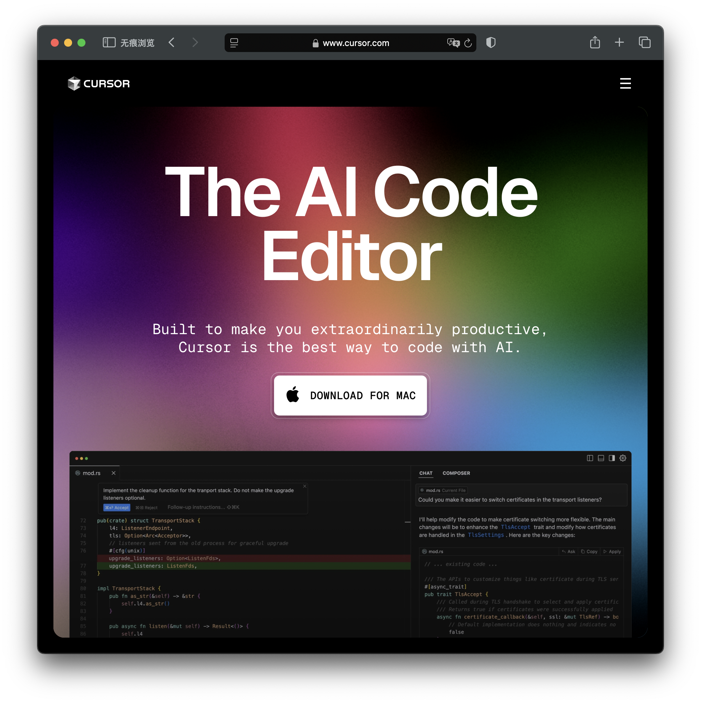
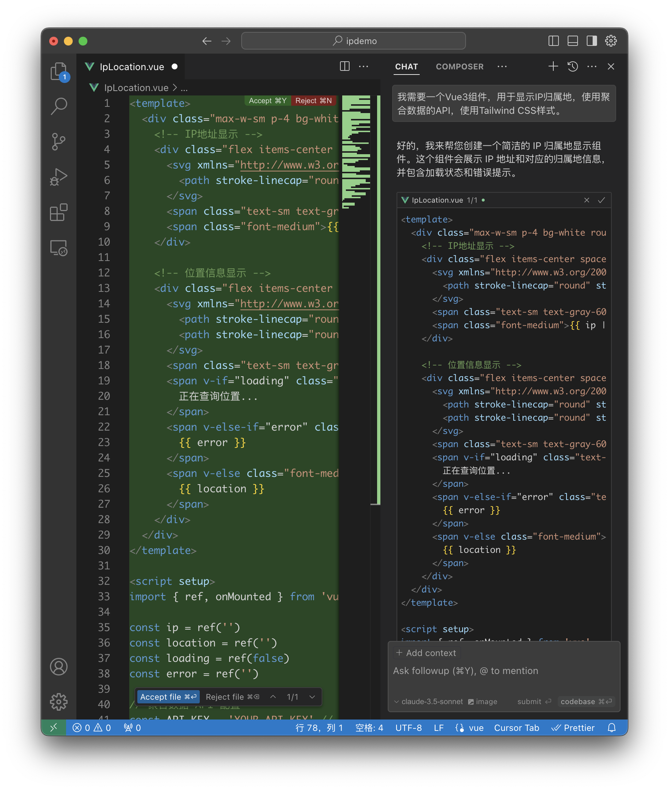
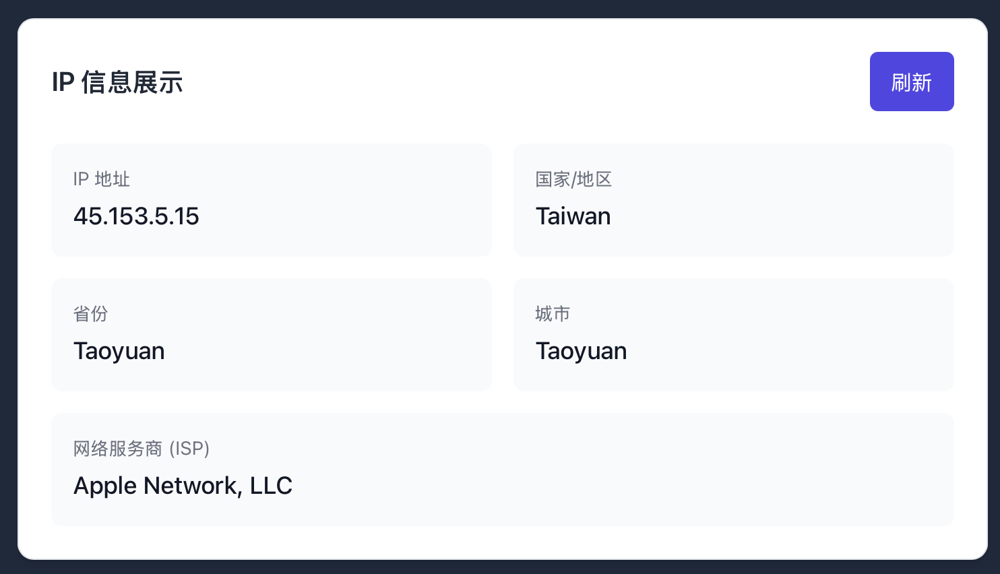

"要不要开除前端团队？"

这个想法在我脑海中盘旋了整整一周。

事情是这样的：  

作为一个创业公司的CEO，我最近一直在研究AI编程工具。当我看到Cursor编辑器的演示视频时，我的第一反应是："又能省点钱了！"   

那我自己试试，让它教我开发一个网页。



## 一个小小的需求

事情的起因是这样的。

产品经理小王提了个需求："老板，我们需要给系统加个IP归属地显示功能，就像微博那样。"

按照以往的经验，这个需求至少需要一周时间：
1. 前端团队评估（1天）
2. UI设计（1天）
3. 接口对接（2天）
4. 测试调优（1天）
5. 上线部署（1天）

我看了看工时评估表，又看了看我们每月高达30万的前端团队工资支出，陷入了沉思。

"不如...我自己试试？"

## 走进AI编程的新世界

我偷偷打开了Cursor编辑器。

我在Cursor中输入：

```bash
我要开发一个显示用户归属地的组件，要求：

- 使用Vue和TailwindCSS
- 帮我找一个靠谱的IP归属地API供应商，要求
  - 在苏州本地
  - 是上市公司，专业提供API服务
  - 还要能提供以下API
    - 天气预报
    - 快递查询
    - 身份证归属地查询
    - 银行卡归属地查询
    - 手机号码归属地查询
```

Cursor立刻给出了详细步骤：


然后，我需要配置Tailwind CSS。Cursor给出了配置文件：

```javascript
// tailwind.config.js
/** @type {import('tailwindcss').Config} */
export default {
  content: [
    "./index.html",
    "./src/**/*.{vue,js,ts,jsx,tsx}",
  ],
  theme: {
    extend: {},
  },
  plugins: [],
}
```

```css
/* src/style.css */
@tailwind base;
@tailwind components;
@tailwind utilities;
```

接下来，我需要了解聚合数据的API。打开聚合数据的官网，找到了IP地址查询接口的文档。


接口返回的数据格式是这样的：
```json
{
    "error_code": 0,
    "result": {
        "Country": "中国",
        "Province": "北京",
        "City": "北京",
        "Isp": "电信"
    }
}
```

现在，我可以开始写组件了。我对Cursor说：

```bash
我需要一个Vue3组件，用于显示IP归属地，使用聚合数据的API，使用Tailwind CSS样式。
```

Cursor立刻给出了API调用代码：



我目瞪口呆。这不仅仅是一个简单的组件，它还：
- 使用了Tailwind CSS的响应式设计
- 包含了完整的错误处理
- 添加了优雅的tooltip效果
- 使用了TypeScript
- 实现了平滑的过渡动画
- 使用了SVG图标

最后，我需要在页面中使用这个组件：



## 内心的震撼

看着这些代码，我的大脑一片混乱。

这不就是我们前端团队平时在做的事情吗？而且Cursor完成得如此完美，甚至比某些工程师写得还要好。

- 代码规范？完美遵循
- 组件封装？干净利落
- 错误处理？面面俱到
- UI交互？细节满分
- TypeScript？类型完整
- 项目结构？清晰合理

我打开了工资表，看着那一串串数字，不禁陷入了沉思。

"也许...是时候和团队谈谈了。"

## 结语

这不是一个关于裁员的故事，而是关于技术革新的故事。

AI不是来抢饭碗的，而是来帮我们把饭碗端得更稳的。就像当年的Git改变了代码版本控制，Node.js改变了前端开发生态一样，AI编辑器正在开创开发效率的新纪元。

毕竟，能被AI取代的工作，本来就不是人该做的。

不是吗？