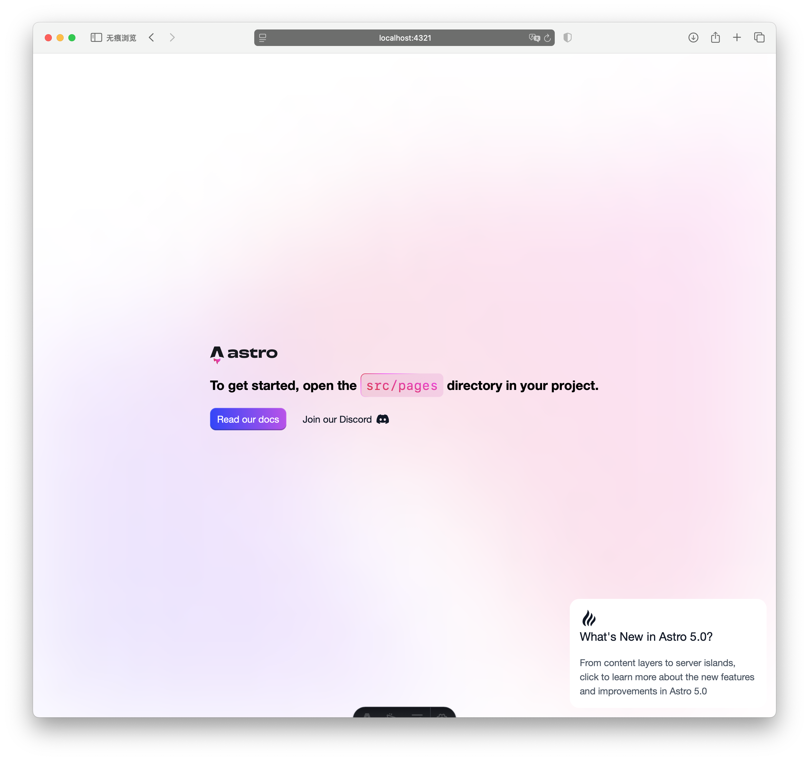

## 项目初始化

在开始开发之前，我们需要先初始化项目。我们将按照以下三个主要步骤来进行：

1. 使用 pnpm 创建 Astro 项目
2. 使用 GitHub Desktop 推送项目
3. 安装配置 Tailwind CSS 和 DaisyUI

### 第一步：创建 Astro 项目

1. 创建 Astro 项目：

```bash
# 创建项目
pnpm create astro@latest web-toolbox

# 按照提示进行配置：
# 1. 选择基础模板
# 2. 选择安装依赖
# 3. 选择使用 TypeScript（推荐）
# 4. 选择 Strict 类型检查（推荐）

# 进入项目目录
cd web-toolbox
```

2. 启动项目并查看：

```bash
pnpm dev
```

打开其中展示的网址，会看到以下界面：



### 第二步：使用 GitHub Desktop 推送项目

由于 Astro 在初始化项目时已经完成了 Git 仓库的配置，我们只需要使用 GitHub Desktop 将项目推送到 GitHub 即可。

1. 添加本地项目：
   - 打开 GitHub Desktop
   - 点击 "File" > "Add Local Repository"
   - 选择项目所在目录（web-toolbox 文件夹）
   - GitHub Desktop 会自动识别这是一个 Git 仓库

2. 创建 GitHub 仓库：
   - 点击 "Publish repository"
   - 填写仓库信息：
     - Name: web-toolbox
     - Description: 在线工具箱项目
     - 选择是否保持仓库私有（推荐选择 Public）
   - 点击 "Publish Repository"

现在你的项目已经成功托管到 GitHub 上了。你可以通过 GitHub Desktop 方便地进行代码的提交、推送和拉取操作。

### 第三步：安装配置 Tailwind CSS

1. 安装 Tailwind CSS 集成：

```bash
# 安装 Astro Tailwind 集成
pnpm astro add tailwind
```

2. 配置 Tailwind CSS（`tailwind.config.mjs`）：

```javascript
/** @type {import('tailwindcss').Config} */
export default {
  content: ['./src/**/*.{astro,html,js,jsx,md,mdx,svelte,ts,tsx,vue}'],
  theme: {
    extend: {},
  },
}
```

3. 创建全局样式文件（`src/styles/global.css`）：

```css
@tailwind base;
@tailwind components;
@tailwind utilities;
```

4. 在布局文件中引入样式（`src/layouts/Layout.astro`）：

```astro
---
import '../styles/global.css';
---

<!DOCTYPE html>
<html lang="zh-CN">
  <head>
    <meta charset="UTF-8" />
    <meta name="viewport" content="width=device-width" />
    <title>在线工具箱</title>
  </head>
  <body>
    <slot />
  </body>
</html>
```

### 第四步：安装配置 DaisyUI

1. 安装 DaisyUI：

```bash
# 安装 DaisyUI
pnpm add -D daisyui
```

2. 在 Tailwind CSS 配置中添加 DaisyUI 插件（`tailwind.config.mjs`）：

```javascript
/** @type {import('tailwindcss').Config} */
export default {
  content: ['./src/**/*.{astro,html,js,jsx,md,mdx,svelte,ts,tsx,vue}'],
  theme: {
    extend: {},
  },
  plugins: [require("daisyui")],
  daisyui: {
    themes: true,
  },
}
```

3. 验证安装：
   - 重启开发服务器
   - 在任意组件中使用 DaisyUI 的组件类名
   - 确认样式是否正确应用

### 第五步：安装配置 Vue

1. 安装 Vue 集成：

```bash
# 安装 Astro Vue 集成
pnpm astro add vue
```

2. 验证安装：
   - 创建一个 Vue 组件（`src/components/Counter.vue`）：

```vue
<template>
  <div class="counter">
    <button @click="count--">-</button>
    <span>{{ count }}</span>
    <button @click="count++">+</button>
  </div>
</template>

<script setup>
import { ref } from 'vue'

const count = ref(0)
</script>

<style scoped>
.counter {
  display: flex;
  gap: 1rem;
  align-items: center;
}
button {
  padding: 0.5rem 1rem;
  border: 1px solid #ccc;
  border-radius: 4px;
}
</style>
```

3. 在 Astro 页面中使用 Vue 组件：

```astro
---
import Counter from '../components/Counter.vue';
---

<div>
  <Counter client:load />
</div>
```

注意：在 Astro 中使用 Vue 组件时，需要添加 `client:` 指令来指定组件的加载策略。常用的指令包括：
- `client:load`：页面加载完成后立即加载组件
- `client:idle`：浏览器空闲时加载组件
- `client:visible`：组件进入视口时加载
- `client:media`：满足媒体查询条件时加载
- `client:only`：仅在客户端渲染，跳过服务器端渲染

4. 创建 `.gitignore` 文件：

```plaintext
# Logs
logs
*.log
npm-debug.log*
yarn-debug.log*
yarn-error.log*
pnpm-debug.log*
lerna-debug.log*

node_modules
dist
dist-ssr
*.local

# Editor directories and files
.vscode/*
!.vscode/extensions.json
.idea
.DS_Store
*.suo
*.ntvs*
*.njsproj
*.sln
*.sw?
```

### 启动开发服务器

```bash
# 启动开发服务器
pnpm dev
```

访问 `http://localhost:5173` 查看项目。

## 目录结构

让我们来了解 Astro 项目的目录结构，以及如何组织我们的代码。

### 核心目录

```bash
web-toolbox/
├── src/
│   ├── components/     # 可复用组件（.astro, .vue, .jsx 等）
│   ├── layouts/        # 布局组件
│   ├── pages/          # 页面组件（基于文件的路由）
│   ├── styles/         # 全局样式
├── public/             # 静态资源
└── astro.config.mjs    # Astro 配置文件
```

让我们详细了解每个目录的用途：

1. **components/**
   - 存放可复用的 Astro 组件
   - 支持多种框架组件（.astro, .vue, .jsx 等）
   - 建议按功能模块分组

2. **pages/**
   - 基于文件的路由系统
   - 文件路径即 URL 路径
   - 支持动态路由和嵌套路由
   - 支持 .astro, .md, .mdx 等多种文件格式

3. **layouts/**
   - 页面布局模板
   - 包含公共元素（如导航栏、页脚）
   - 可以定义多个布局并在页面中使用

4. **styles/**
   - 全局样式文件
   - CSS 和 Tailwind 配置
   - 主题相关样式

5. **public/**
   - 静态资源文件
   - 直接通过 URL 访问
   - 不需要构建的资源

## 下一步

现在我们已经完成了项目的初始化和基础结构设计，接下来我们将：

1. 实现基础布局
2. 开发导航菜单
3. 创建通用组件
4. 配置状态管理